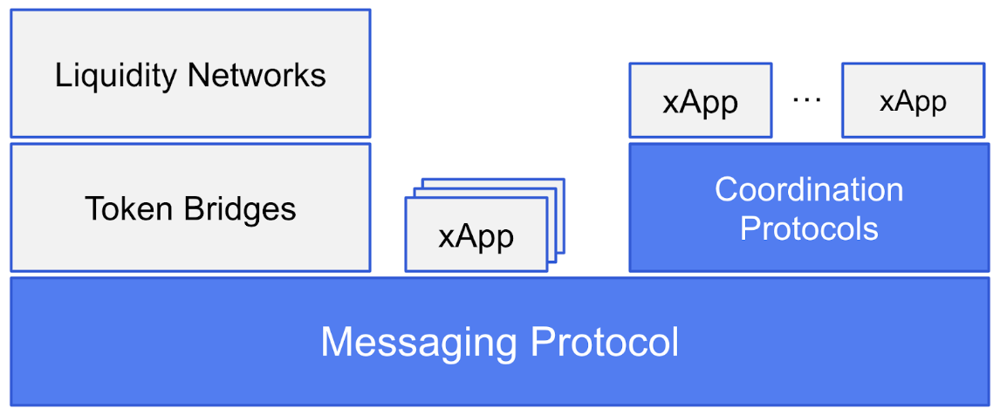

# Protocol Architecture Risk
Risks that stem from the security properties, assumptions, trade-offs, and limitations of the design of a protocol are collectively referred to as _Protocol Architecture Risks_.  To methodically analyze protocol architecture risk, we first discuss a conceptual model for organizing crosschain protocols into layers of abstraction based on scope and functionality. The framework is primarily based on the [work by L2Beat and Socket](https://gov.l2beat.com/t/l2bridge-risk-framework/31) and is illustrated in the diagram below. In this framework, each layer depends on layers below it for functionality and security. Hence, the architectural risks at each layer subsume those below it. 

<figure markdown>
  {width=600}
  <figcaption>Layers of Crosschain Communication Protocols</figcaption>
</figure>






