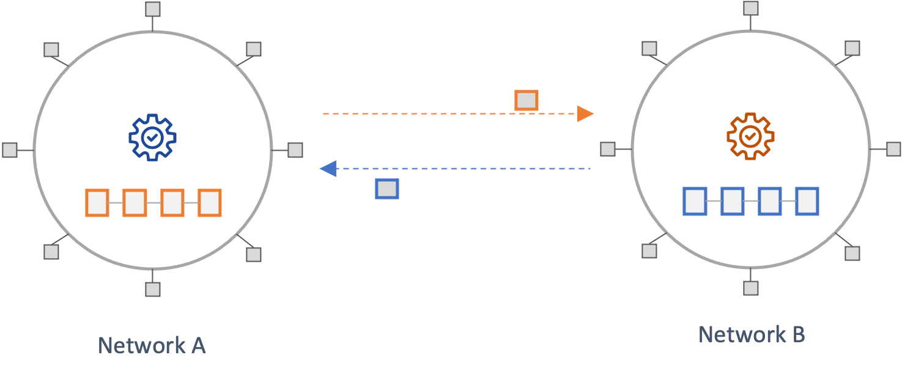
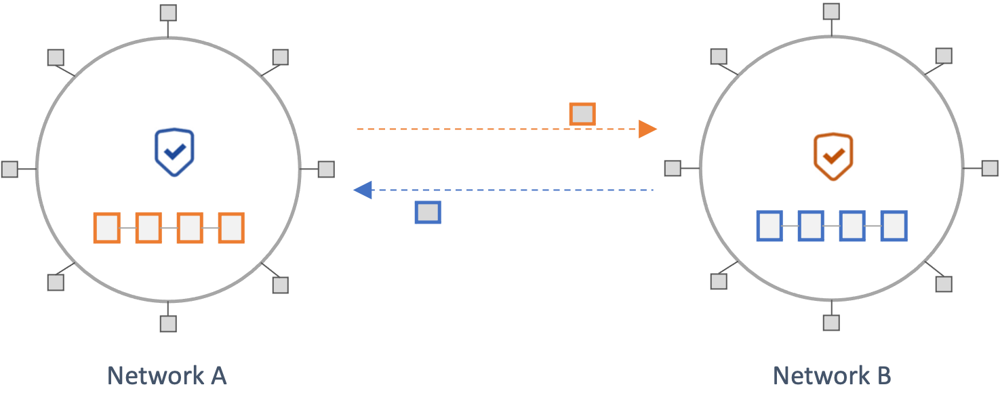
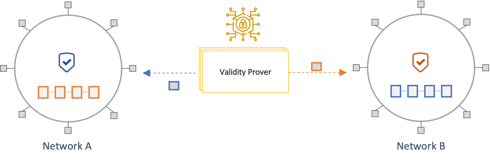
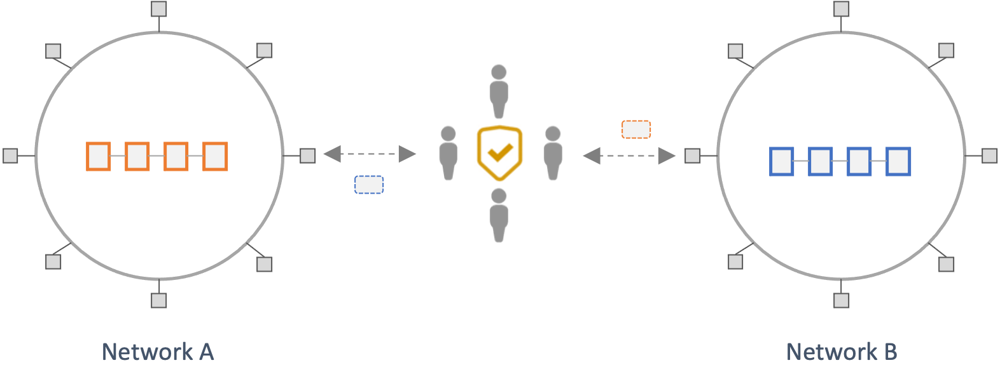
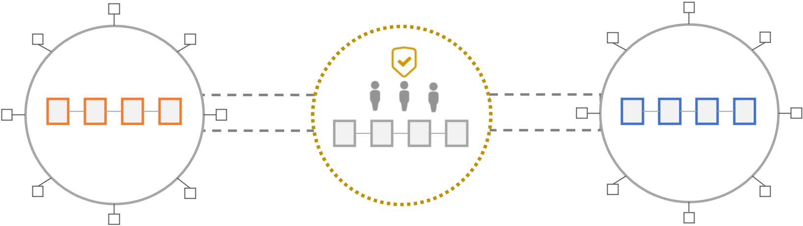

### Messaging Protocol
Messaging protocols provide the following two foundational capabilities that are relied upon by crosschain applications built on top of them.

1. Transmission of state information from a source network to a destination network in a timely manner
1. Ensuring the validity and finality of any information sent from a source network to a destination network

Messaging protocols must ensure the transmission of all crosschain messages (capability 1) while providing strong guarantees about their validity and finality (capability 2) in the source network. The former mainly highlights [liveness](https://en.wikipedia.org/wiki/Safety_and_liveness_properties#Liveness) and censorship resistance property, while the latter emphasizes [safety](https://en.wikipedia.org/wiki/Safety_and_liveness_properties#Safety). The architecture of crosschain protocols is largely differentiated by how they offer guarantees around safety. An ideal construction would introduce no additional trust assumptions beyond what is assumed about the underlying networks. For a message sent from a source network to a destination network, this would involve the destination networks independently:

1. Validating that a state transition that resulted in a given message is valid according to the state transition rules of the source network and
1. Verifying that the message has been finalized according to its consensus rules of the source network

A protocol that performs one or both of the above verifications to ensure the validity of a remote network's state is considered *trustless* or *trust-minimized*. Conversely, a protocol that relies on intermediaries, or a subset of network validators, vouching for the validity of a remote state is considered *trusted*, or *semi-trusted*. In line with this, four broad architectural patterns are identified below. Not all crosschain protocols in the wild neatly fit into these categories, and some employ hybrid approaches. 

#### State Validating Protocols
In *State Validating Protocols*, a destination chain independently verifies that any state it receives is valid and final according to the source network's state transition and consensus rules. This model inherits the security guarantees of the underlying networks without introducing new trust assumptions.  

The only examples of such architecture, at present, are the native bridges between layer-one networks and their associated rollups (Optimistic and Zero-Knowledge rollups). In such models, there is, in effect, only a single source of truth, the state of the layer-one network. This is different from crosschain communication across independent layer-one networks. Hence, while this model offers significant security advantages, applying it across separate networks is currently not viable. However, with advances in [Zero-Knowledge cryptography](https://ethereum.org/en/zero-knowledge-proofs/), this could change. Efforts such as [stateless Ethereum](https://docs.ethhub.io/ethereum-roadmap/ethereum-2.0/stateless-clients/) focus on having succinct proofs of the network's state that clients can independently verify. An example of a protocol that offers similar properties is the [Mina protocol](https://minaprotocol.com/). Such capabilities could eventually enable state-validating protocols across distinct layer-ones.

<figure markdown>
  {width=650}
  <figcaption>State Validating Crosschain Protocols</figcaption>
</figure>

*Considerations:* While this approach offers strong security guarantees from a design perspective, it is worth noting that implementation and operational risks are still present.

#### Consensus Verifying Protocols
In Consensus Verifying Protocols, a destination network independently verifies that any state received from a source chain has been finalized according to its consensus rules. Such protocols might not perform full consensus verification checks but rather employ lightweight mechanisms similar to a network's light-client protocol. Unlike State Validating Protocols, this approach does not execute or verify the validity of transactions that update the state. While this approach offers less security than State Validating Protocols, it, too, does not introduce significant new trust assumptions.

Examples of the type of verification performed by *Consensus Verifying Protocotols* include checking that sufficient proof-of-work has been expended on a block, in the case of Proo-of-Work protocols, or that a quorum of network validators has signed a block in BFT-based protocols. Because a *Consensus Verifying Protocol*, in effect, implements a light-client protocol of a source network on a  destination network, it inherits the associated light-client protocol's security properties, limitations, and potential attack vectors. For instance, the light-client protocol for Ethereum Proof-of-Stake does not verify full consensus. Instead, it relies on the attestations of a subset of 512 validators called the sync committee, randomly selected and rotated every 27 hours. Because of the relatively small size of this validator set and the fact that they, at present, cannot be slashed for equivocating, this model offers weaker security guarantees than full-consensus verification. 

A significant constraint to the overall viability of such approaches is the complexity associated with building and maintaining such protocols and the prohibitive costs associated with operating them. In addition, the cost of running such infrastructure is a factor of the source network's block production rate rather than a function of the demand for crosschain messaging. Hence, such bridges might need to charge high fees and gain significant usage to offset operation costs. 

There are two distinct models of such, based on whether the consensus verification is performed on-chain or off-chain. 

##### On-chain Consensus Verification
This model involves performing light-client verification of a source chain's state in the execution environment of the destination. First, block headers from a source network are sent to a destination network by off-chain actors called *Relayers*. The destination chain then performs consensus verification on the block, typically through logic implemented in a smart contract. A user can then prove that a state exists in the source network using a [Merkle proof](https://computersciencewiki.org/index.php/Merkle_proof) against the verified block header on the destination. This proof can then be used to trigger a subsequent transaction on the destination chain. 

Because of the constraints of most smart contract languages and blockchain execution environments, such models can be complicated to build and prohibitively expensive to operate (e.g., gas costs).

<figure markdown>
  {width=650}
  <figcaption>On-chain Consensus Verifying Protocols</figcaption>
</figure>

*Considerations*

- How does the protocol deal with the security limitations and potential attack vectors of the associated light-client protocols? (e.g., Eclipse Attacks, Long-range attacks)
- Is the role of relaying blocks across chains permissionless? If the role is permissioned, then Relayers can censor transactions.
- How long can the bridge go without receiving new blocks before the bridge's security is affected?
- What are the financial incentives for relayers? Given these entities incur network fees associated with relaying blocks to different destination networks, how are they compensated? Is this model sustainable?
- What are the costs of operating the bridge? Are these sustainable under low-demand scenarios? 
- Can the on-chain implementation adapt to changes in the source network's consensus protocol? What are there challenges and constraints to making such changes?
- The increased complexity of building such protocols significantly increases implementation risk.

##### Validity-Proof based Consensus Verification
In this model, an off-chain system called a *Prover* generates a [SNARK](https://z.cash/technology/zksnarks/) proof that a state in a source network has been finalized according to its consensus protocol. The proof is sent to a destination chain, which then verifies its validity using logic implemented in a smart contract (*Verifier*). Hence, this model shifts most of the complexity and cost of performing light-client consensus verification off-chain while retaining the security advantages of crosschain consensus verification.

These types of bridges are also referred to as Zero-knowledge Bridges (ZK Bridges). However, this terminology is misleading, as such protocols rely only on the *succinctness* properties of SNARKs and do not apply information hiding (i.e., Zero-knowledge).

<figure markdown>
  {width=700}
  <figcaption>Validaity Proof Protocols (ZK Bridges)</figcaption>
</figure>

*Considerations*

The same considerations as those laid out for *On-chain Consensus Verification* schemes apply to these protocols. Additional considerations include:

- Is the role of prover permissionless? If not, how many provers are there? What are the criteria for becoming a prover? How are they coordinated? 
    - Provers can technically censor transactions or become a source of liveness issues for the network
    - Carrying out an eclipse attack against a single prover is more tractable than several provers
    - How are provers incentivized?
    - The computations performed by a prover can be expensive, which might discourage participation.
- What are there trusted setup assumptions of the underlying cryptographic mechanisms? 
- The increased complexity of building such protocols increases implementation risk.

#### Third-party Attestation Protocols
The above approaches derive their security guarantees from the underlying chains because they involve each chain locally verifying, to some extent, the validity of the state from another chain. This avoids introducing additional trust assumptions and offers better security guarantees. However, such protocols are complex and costly to build, operate, and scale across diverse ecosystems. 

Hence, most crosschain protocols introduce intermediary sources of trust in the form of third-party attestors (also referred to as validators). These third-party attestors attest to the validity of crosschain messages from a source network and then send them to a destination network. A destination network accepts as valid any state that is certified by a majority of the trusted third-party attestors. Hence the safety and liveness properties of such protocols rely on a threshold of honest attestors (M of N security model).

<figure markdown>
  {width=650}
  <figcaption>Third-party Attestation Protocols</figcaption>
</figure>

<figure markdown>
  {width=700}
  <figcaption>Third-party Attestation Protocols with Intermediary Network</figcaption>
</figure>

Protocols in this category vary widely on at least the following three dimensions:

1. Coordination mechanism: Off-chain communication, Dedicated intermediary network
1. Cryptographic mechanism: Multi-Signature, Threshold signature, Trusted Execution Environment (e.g., Intel SGX)
1. Security model (Proof-of-Authority, Proof-of-Stake)

The security model of these protocols defines the security properties of and assumptions about the third-party attestors. 
There are generally two models, Proof-of-Authority and Proof-of-Stake, which are further discussed below.

##### Proof-of-Authority 

Proof-of-Authority models rely on reputable legal entities serving as attestors. These bridges assume that a) such parties are strongly incentivized to maintain their reputation and would thus not act maliciously and b) that in the event of misbehavior, stakeholders can pursue legal recourse against such entities. These assumptions are difficult to reason about and rely on external structural assurances (e.g., legal systems) instead of internal protocol mechanisms.

  *Considerations*

  * How many distinct attestors does the protocol have? What are the specific honesty threshold assumptions for guaranteeing safety and liveness? What are the particular characteristics of the cryptographic schemes used?
  * How reputable are such entities? What is the actual cost of reputational damage for such entities? What is the market cap of such entities?
  * How do the above disincentives to misbehavior compare against the TVL or total volume transacted by layers atop the messaging bridge?
  * Do such entities have competing interests with users of this bridge? e.g., Trading firms that might benefit from cross-domain MEV?
  * Can the claims around decentralization be verified on-chain? For instance: 
    * The number of validators and the threshold for achieving a quorum. Multi-signature schemes are easier to verify on-chain compared to MPC or threshold signature schemes. 
    * The active validator set. While a bridge might employ many validators, it is possible that only a few actively participate in validating and attesting to messages. This could be because the economics of validating messages are not worthwhile to some validators. This means that the effective validator set is smaller, and the decentralization and security guarantees of the bridge weaker. The [Ronin bridge hack](https://rekt.news/ronin-rekt/) highlights an example of this scenario.
  * In what jurisdictions are the entities domiciled?
  * Can regulations coerce these entities to censor transactions?

##### Proof-of-Stake

Proof-of-Stake models rely on validators having financial incentives to behave honestly according to the rules of the protocol. This is typically achieved by having each validator stake funds in the protocol that can be slashed if the validator misbehaves. Unlike proof-of-authority schemes, this offers an immediate and in-protocol method of punishing malicious behavior. 

   *Considerations*

  * How many distinct attestors does the protocol have? What are the specific thresholds for guaranteeing safety and liveness? What are the particular characteristics of the cryptographic schemes used?
  * Can the claims around decentralization be verified on-chain? For instance: 
    * The distribution of staked tokens across validators (i.e., concentrated amongst few parties vs. diffuse across many parties)
    * The number of validators and the threshold for achieving a quorum (multi-signature schemes might be easier to verify on-chain than threshold signature schemes). 
    * The active validator set. While a bridge might employ many validators, it is possible that only a few actively participate in validating and attesting to messages. 
  * What exactly is staked by validators? Is it a bridge-specific token? What are the dynamics that drive the value of such tokens? How liquid is the token?
  * How does the value of staked funds compare against the volume of assets transacted across the bridge?
  * What is the cost of bribing or corrupting a threshold of such validators to violate safety or liveness?
  * How does the bridge adapt to active misbehavior by a portion of the validators?

#### Optimistic Protocols
Optimistic protocols rely on agents that validate crosschain transactions by signing a Merkle root with data from the source network and post it on the destination network. Once this data is posted, a challenge window begins, during which anyone monitoring the bridging system can challenge a fraudulent transaction by submitting fraud proofs on the source network and prevent it from being confirmed on the destination network. Such bridges assume that a) agents are incentivized to sign only legitimate transactions because their bonded funds will be slashed if they act maliciously and b) that in the event an agent does sign a fraudulent transaction, one honest actor will be watching the system, and they will flag the fraudulent transaction by submitting a fraud-proof on the source network within the challenge window. Thus, optimistic bridges have a 1 of N security model, which relies on one honest actor watching the system to correctly verify crosschain transactions.

  *Considerations*
  
  * How many agents are employed by the bridge to sign and validate transactions? Is this set of agents centralized? If so, can the agents conduct a Denial-of-Service (DoS) attack by not signing a merkle root? In such cases, will the system halt?
  * What exactly is the bonded stake of agents? Is it a bridge-specific token? What are the dynamics that drive the value of such tokens?
  * What is the cost of bribing or corrupting the agents to violate safety? Is this correlated with the price of a token?
  * Can agents, on their own or due to regulations, censor messages? Can such entities be removed from the set of agents to prevent censorship?
  * How will the liveness of an application be affected if an agent faces downtime? Will the application stop receiving messages?
  * How many actors are watching the network to detect fraudulent transactions?
  * Can anyone monitor the system to detect fraudulent transactions? If not, and the set of actors watching the system is permissioned, does that make the cost of corrupting it known? 
  * Is the optimistic bridge “spam-proof” – meaning can an actor watching the system arbitrarily dispute transactions without penalty? Can such actors permanently halt a communication channel by spamming it?
  * Can anyone watching the system, on their own or due to regulations, censor messages? Can such entities be removed from the set of actors watching the system to prevent censorship?
  * Do the actors watching the system have competing interests with users of the bridge? e.g. trading firms that could benefit from front-running a big volume crosschain transaction or from cross-domain MEV?

A number of protocols employ a hybrid approach to bridging that leverages different approaches for a more robust crosschain solution. For example, Celer Inter-chain Message (Celer IM), utilizes a proof of stake approach by default but offers an optimistic-rollup inspired security model as a fallback solution in the worst-case scenario where validators behave maliciously in the PoS approach. 
