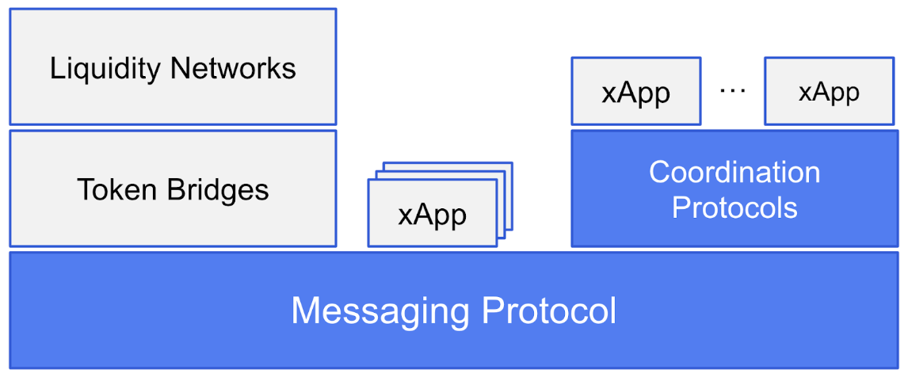

## Protocol Architecture Risk
Protocol architecture risks relate to the design of the cross-chain communications protocol. The major consideration is the communications protocol trust assumptions. However, other more detailed design considerations can impose important risks.






